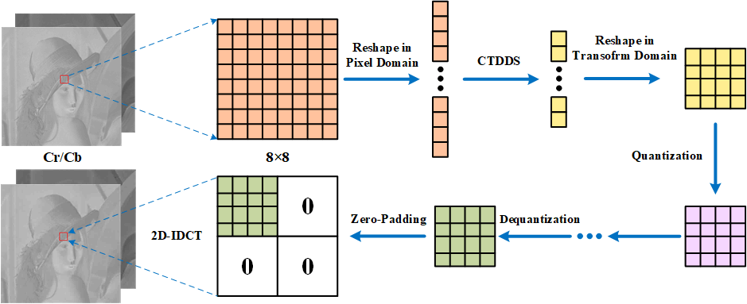
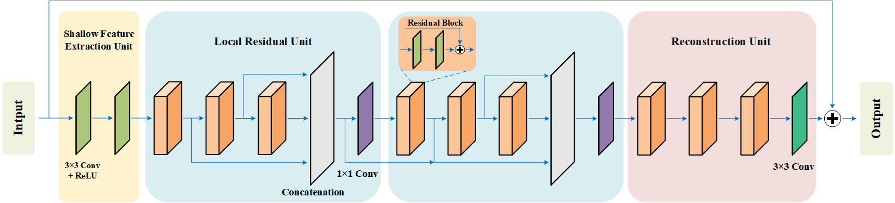

# Color Image Compression with Transform Domain Down-Sampling and Deep Convolutional Reconstruction

Implementation of "Color Image Compression with Transform Domain Down-Sampling and Deep Convolutional Reconstructio" 

VCIP2019

## CTDDS

<p align="center">
     <br />
    <em> Compression dependent transform domain down-sampling</em>
</p>

##

## Deep Convolutional Reconstruction
<p align="center">
     <br />
    <em> Deep Convolutional Reconstruction </em>
</p>

## Installation
The code was developed using Python 3.5 & TensorFlow 1.9.0 & CUDA 9.0. 

## Code v1.0
Currently, we release our research code for testing. It should produce the same results as in the paper under default configuration.
## Testing
* It's easy to understand testing functions and to test your own data.
* An example of test usage is shown as follows:
```bash 
python test.py
```


## Citation

If you use any part of our code, or our method is useful for your research, please consider citing:

```
@inproceedings{CTDDSCNN2019,
author = {Yan, Wang and Shuyuan, Zhu and Xiandong, Meng and Bing, Zeng and Yuanfang, Guo},
title = {Color Image Compression with Transform Domain Down-Sampling and Deep Convolutional Reconstruction},
booktitle = {VCIP},
year = 2019
}
```
## Contact
We are glad to hear if you have any suggestions and questions. 
Please send email to [ywang@std.uestc.edu.cn](mailto:ywang@std.uestc.edu.cn)